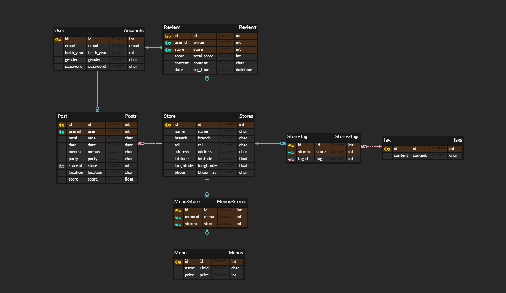
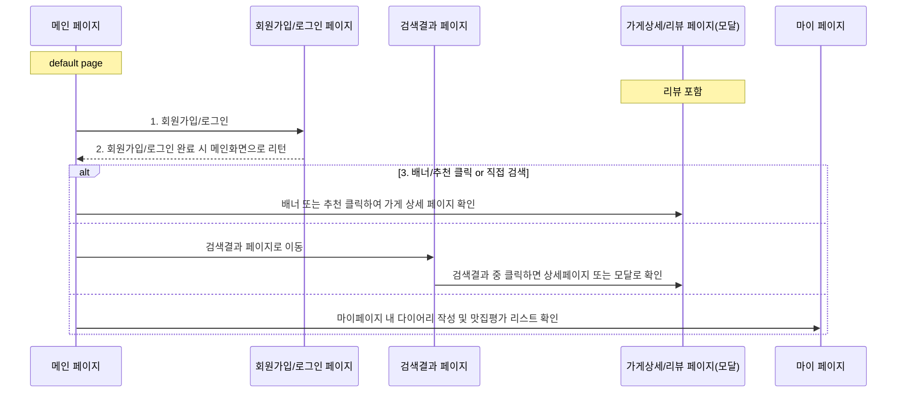
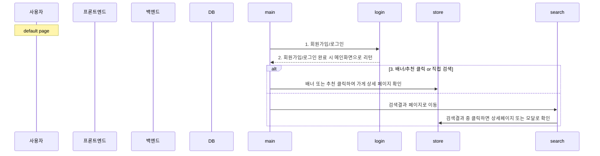

# SSAFY Bigdata project | A103

### 1. 팀원 역할

- 팀장: 박민식
- 백엔드: 김지희, 오동현
- 프론트엔드: 김한솔, 박민식, 윤도희
- GIT 관리 담당: 윤도희
- JIRA 관리 담당: 오동현

### 2. 프로젝트 개요

#### | 프로젝트 목표

협업 필터링 기법으로 구현한 추천 시스템의 결과물을 웹 서비스 형태로 만들어 제공한다. Django와 React를 활용하여 웹 서버와 클라이언트를 모두 구현하여 REST 방식으로 통신하도록 하고, 회원가입, 로그인, 리뷰 보기/작성 등 기본적인 웹 서비스 기능을 구현한다.

- Javascript, Node.js 학습
- REST(Representational State Transfer) 스타일 학습 및 적용
- Numpy, Scipy, Scikit-learn, Surprise 라이브러리 학습 및 적용
- Django 백엔드 학습 및 구축
- React 프론트엔드 학습 및 구축
- 유사도(Similarities) 학습 및 구현
- 협업 필터링(Collaborative Filtering) 알고리즘 학습 및 구현

#### | 맛집추천 서비스 시장조사

- 다이닝코드
- 네이버 플레이스
- SEE HOW YOU EAT

#### | 서비스 컨셉 및 개요

- 서비스명: YUMMY DIARY
- 서비스 컨셉: 맛집 추천 + 푸드 다이어리
- 서비스 로고:

### 3. ERD

### 4. Sequence Diagram

#### | 고객여정지도

#### | 회원가입/로그인

### 5. Wireframe

참고링크: [OvenLink](https://ovenapp.io/project/qfxMC5NrUIRdlrPexdxMWkboxz45zxKn#Edwc0)