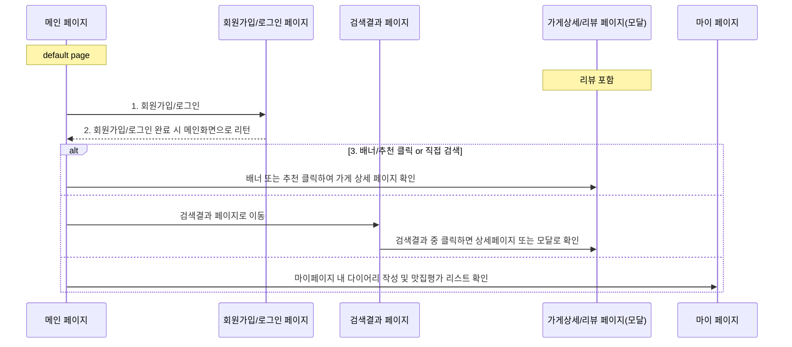

# SSAFY Bigdata project | A103

### 1. 팀원 역할

- 팀장: 박민식
- 백엔드: 김지희, 오동현
- 프론트엔드: 김한솔, 박민식, 윤도희

### 2. 프로젝트 개요

### 3. Sequence Diagram

```mermaid
sequenceDiagram
	participant main as 메인 페이지
	participant login as 회원가입/로그인 페이지
	participant search as 검색결과 페이지
	participant store as 가게상세/리뷰 페이지(모달)
	participant mypage as 마이 페이지
	Note over main: default page
	Note over store: 리뷰 포함
	main ->> login : 1. 회원가입/로그인
	login -->> main : 2. 회원가입/로그인 완료 시 메인화면으로 리턴
	alt 3. 배너/추천 클릭 or 직접 검색
	main ->> store : 배너 또는 추천 클릭하여 가게 상세 페이지 확인
	else
	main ->> search : 검색결과 페이지로 이동
	search ->> store : 검색결과 중 클릭하면 상세페이지 또는 모달로 확인
	else
	main ->> mypage : 마이페이지 내 다이어리 작성 및 맛집평가 리스트 확인
	end
	
```

